<picture>
  <source media="(prefers-color-scheme: dark)" srcset="assets/hero-dark.svg">
  <source media="(prefers-color-scheme: light)" srcset="assets/hero-light.svg">
  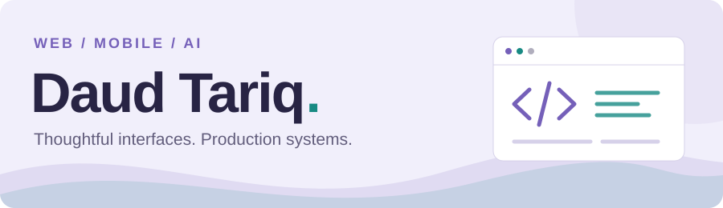
</picture>

  <strong>Associate Software Engineer · Lahore, Pakistan</strong> 
  Building scalable web, mobile, and AI-powered products.

  
  &nbsp;
  

[About](#01--about) · [Stack](#02--stack) · [Experience](#03--experience) · [Projects](#04--selected-projects) · [Activity](#05--github-activity)

---

## 01 — About

I'm a Computer Science graduate with **2+ years of experience** building production web and mobile applications across **real estate, fintech, and AI**. My strongest foundation is the React and TypeScript ecosystem, with work spanning backend APIs, database-backed systems, and AI integrations.

I care about scalable frontend architecture, reusable components, and developer tooling that makes shipping and maintaining products easier.

## 02 — Stack

**Frontend**

  
  
  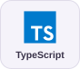
  
  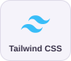
  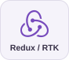

**Mobile**

  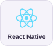

**Backend & languages**

  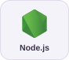
  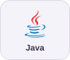
  
  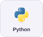
  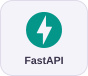
  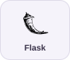
  
  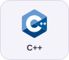

**Databases & data tooling**

  
  
  
  
  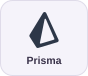
  

**AI & integrations**

  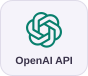
  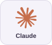
  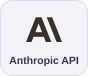
  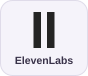
  
  

**Tools & cloud**

  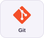
  
  
  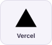

Redux / RTK includes RTK Query · MCP = Model Context Protocol

## 03 — Experience

### Dubizzle Labs
**Associate Software Engineer · Current**

Building web and mobile experiences across the Bayut, Dubizzle, and OLX product ecosystem. My work spans **MyZameen.com with Next.js**, Zameen and Bayut member areas with React, **Jarvis CRM with React Native**, and CarForce for Dubizzle Cars operations. Shared component libraries and automated chatbot experiences connect this work across products.

### CloudCard Inc
**Associate Software Engineer · Previously**

Worked on **Banking-as-a-Service systems**, payment integrations, and microservices. Built React SDKs and Java REST APIs backed by PostgreSQL, including integrations with Fiserv and Real-Time Payments.

## 04 — Selected projects

### Brainite
**AI knowledge infrastructure**

A B2B SaaS platform that extracts structured decision logic from Slack, Notion, GitHub, Jira, and Zendesk, making organizational knowledge available to AI agents through MCP.

React · TypeScript · PostgreSQL · FastAPI · Anthropic API · MCP

Architecture &amp; engineering

- Multi-tenant architecture with PostgreSQL row-level security.
- Authentication APIs and database-backed knowledge access.
- AI agent integrations through the Model Context Protocol.

---

### AI-Powered Training Simulator
**Interactive voice-led training**

A full-stack training simulator built for a US-based public-safety client. AI voice agents power interactive training experiences and client-facing application features. **Client identity is confidential under NDA.**

Next.js · TypeScript · Vercel · ElevenLabs · OpenAI · Anthropic

Application &amp; integrations

- Interactive training flows built around AI voice agents.
- Full-stack Next.js development and client-facing functionality.
- Voice and language-model integrations for training experiences.

---

### [AiForensics](https://github.com/daud4653/AiForensics-A-DeepFake-Content-Detection-System)
**Deepfake detection across images, audio, and video**

A full-stack AI platform that brings detection workflows, authentication, analytics, and an AI chatbot into a single application.

Python · FastAPI · Node.js / Express · React · MongoDB · TensorFlow

Models &amp; application layers

- EfficientNet / ViT and LSTM-based approaches for deepfake detection.
- React frontend and Node/Express backend with authentication.
- Detection workflows supported by analytics and an AI chatbot.

## 05 — GitHub activity

Public work at a glance. These repository statistics complement the production work described above.

<a href="https://github.com/daud4653?tab=repositories">
  <picture>
    <source media="(prefers-color-scheme: dark)" srcset="https://raw.githubusercontent.com/daud4653/daud4653/output/assets/stats-dark.svg">
    <source media="(prefers-color-scheme: light)" srcset="https://raw.githubusercontent.com/daud4653/daud4653/output/assets/stats-light.svg">
    
  </picture>
</a>

Watch the contribution graph

<picture>
  <source media="(prefers-color-scheme: dark)" srcset="https://raw.githubusercontent.com/daud4653/daud4653/output/assets/snake-dark.svg">
  <source media="(prefers-color-scheme: light)" srcset="https://raw.githubusercontent.com/daud4653/daud4653/output/assets/snake-light.svg">
  
</picture>

[Explore my contributions on GitHub](https://github.com/daud4653?tab=overview)

How these visuals stay current

GitHub Actions regenerates the light and dark SVGs every six hours and publishes them to the `output` branch. Statistics cover owned, public, non-fork repositories; languages are counted by each repository's primary language, not lines of code or proficiency. The snapshot date is shown on the card.

The contribution animation uses [Platane/snk](https://github.com/Platane/snk). Both visuals update on a schedule or a manual workflow run; commits in other repositories do not directly trigger this profile workflow.

---

BS Computer Science · FAST National University of Computer and Emerging Sciences (FAST-NUCES)

## Connect

Let's talk about web, mobile, or AI product engineering.

[LinkedIn ↗](https://linkedin.com/in/daud-tariq) · [GitHub ↗](https://github.com/daud4653)

